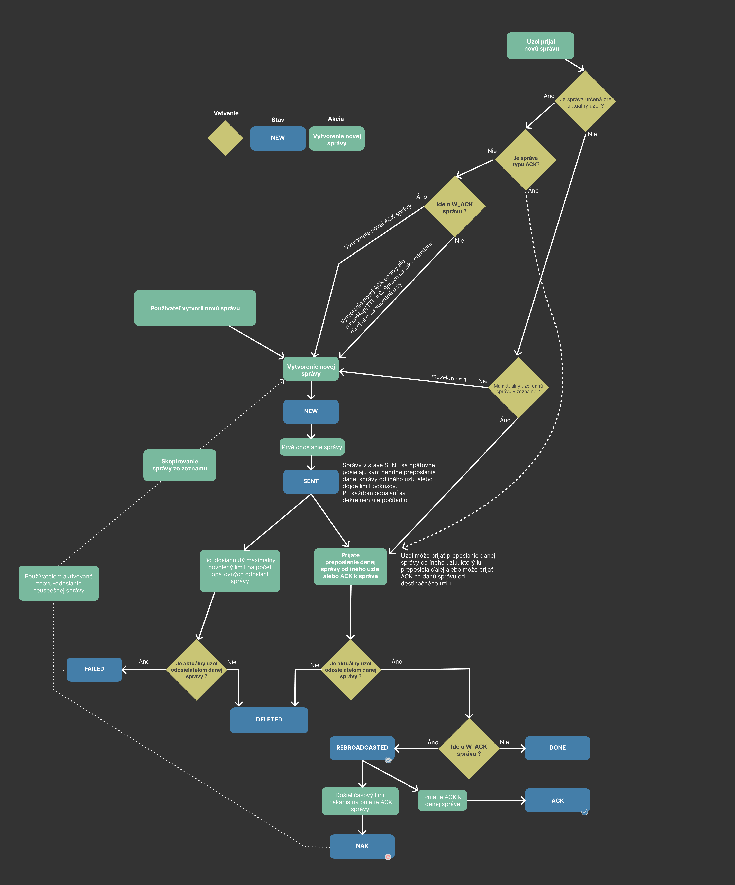

# LoRa Mesh protocol


## Message header
| 2B | 2B | 4B | 2B | 1B | 1B | 0 - 240B |
|----|----|----|----|----|----|----|
|Destination address|Sender address|Message ID|Checksum|Message Type|Priority|Payload|

* Destination address - 0xFFFF reserved for broadcast
* Message ID - random unsigned int, used also in `message queue`
* Checksum - CRC-16/CCITT-FALSE, checksum of destination, sender and message ID. Used to identify messages belonging to this protocol
* Priority - overrides the order in `message queue`
* Message type
  * 0 - ACK confirmation message (Payload not encrypted)
  * 1 - text message
  * 2 - text message with ACK, reffered to as `W_ACK`
  * 3 - sensor data
  * 4 - traceroute request (Payload is empty)
  * 5 - traceroute (Payload not encrypted)

---

## Payload packets

### Text message/Text message with ACK confirmation

| 1B | 1B | 0 - 238B |
|----|----|----|
|Max hop|Initial Max hop|Message|

### Sensor data packet

| 2B | 0 - 238B |
|----|----|
|TTL|data|

### Traceroute request packet

| 1B | 1B |
|----|----|
|Max hop|Initial Max hop|

### Traceroute packet

| 1B | 0 - 239B |
|----|----|
|Max hop|Route path|

### ACK message packet

| 1B | 4B |
|----|----|
|Max hop|Message ID|

* Message ID - ID of the message this ACK is confirming

---

## Message state

* NEW - newly created message
* SENT - message after it was sent for the first time
* REBROADCASTED - used only with `W_ACK` messages, this state is used to wait for ACK confirmation
* ACK - used only with `W_ACK` messages, message has been ACK-ed
* DONE - non `W_ACK` message has been rebroadcasted by at least one other node
* NAK - `W_ACK` message has not been ACK-ed after timeout runs out
* FAILED - message has been sent maximum amount of times(`RESEND_COUNT`) without any other node rebroadcasting it
* DELETED - message is considered deleted, but to prevent repetetive flooding it will stay in the queue until `DELETE_WAIT_TIME` passes

---

## Configuration variables

* RESEND_COUNT - how many times should the message be resent until considered as failed
* RESEND_TIMEOUT - how long to wait before the message is resent (In seconds)
* ACK_WAIT_TIME - how long to wait (In seconds) for ACK message until message is considered as failed(NAK)
* RANDOMIZE_PATH - experimental setting, When enabled it will randomize rebroadcast timeouts (timeout wont be based on SNR). This can help deliver messages that could not be delivered because of not optimal network topology
* DELETE_WAIT_TIME - how long to wait before messages with `DELETED` state are deleted

---

## API

```
MESSAGE_ENTITY = {
  'id': Number, //Message ID
  'order': Number, //Messages will be ordered based on this number
  'from': String, //Sender, hex address is translated (on FE) to contact name if it exists
  'to': String, //Destination, hex address is translated (on FE) to contact name if it exists
  'payload': String
  'msg_type': OneOf('TEXT', 'WACK_TEXT', 'SENSOR', 'TRACEROUTE'),
  'state': OneOf('DONE', 'REBROADCASTED', 'ACK', 'NAK', 'FAILED',)//Optional, set only for messages sent by "me"
  'lora_info': {
    'snr': Number,
    'rssi': Number,
    'lora_config': String //Lora settings, e.g. "Bw500Cr45Sf128"
  }
  'hop_count': Number //Only in text messages
}
```
```
NEW_MESSAGE_ENTITY = {
  'destination': String, //Hex address
  'message': String, //Max 240B
  'max_hop': Number, //0-255
  'priority': Number, //0(Normal priority) or 1(High priority)
  'wack': Bool //Flag if ACK should be received for that message
}
```

## /api/messages?page=0 [GET]

Returns list of messages. Messages are split into pages of 5 messages.
```
data = {
  'messages': [MESSAGE_ENTITY...]
}
```

## /api/send_text_message [POST]

Create and send new message (text messages only).  
Input: NEW_MESSAGE_ENTITY

## /api/traceroute [POST]

Create and send traceroute request.  
Traceroute response will arrive later and be loaded with `/api/messages`  
Input:
```
TRACEROUTE_REQUEST = {
  'destination': String, //Hex address
  'max_hop': Number, //0-255
  'priority': Number, //0(Normal priority) or 1(High priority)
}
```

## /api/contacts [GET]

Returns list of contacts
```
CONTACT_ENTITY = {
  'address': String, //Hex address
  'name': String, //Contact name, max 25 chars
}
```

## /api/contact [PUT]

Create new contact  
Input: `CONTACT_ENTITY`

## /api/contact [DELETE]

Delete contact  
Input: contact address

## /api/sensors [GET]

Returns list of sensors

```
SENSOR_ENTITY = {
  'address': String, //Hex address
  'name': String, //Sensor name, max 25 chars
}
```

## /api/sensor [PUT]

Create new sensor  
Input: `SENSOR_ENTITY`

## /api/sensor [DELETE]

Delete sensor  
Input: sensor address

## /api/dump?page=0 [GET]

Returns all messages that are currently in the message_queue.  
Messages are split into pages, each page contains one message.  
Returned message extends `MESSAGE_ENTITY` by other usefull fields.

## /api/config [GET]

Returns config.
```
CONFIG_ENTITY = {
  'my_address': String, //Hex address
  'aes_key': String,
  'resend_count': Number,
  'resend_timeout': Number,
  'ack_wait': Number,
  'randomize_path': Boolean,
  'monitoring_enabled': Boolean
  'lora_config': String, oneOf(
      "Bw500Cr45Sf128",
      "Bw125Cr45Sf128",
      "Bw250Cr47Sf1024",
      "Bw250Cr46Sf2048",
      "Bw125Cr48Sf4096"
  )
}
```

## /api/config [PUT]

Updates config.  
Input = `CONFIG_ENTITY`

## /api/networks [GET]

Returns list of saved WiFi networks.  
```
NETWORK_ENTITY = {
  'ssid': String,
  'password': String,
  'ap': Boolean //Flag if this network is used as Access Point. Only one such network can exist.
}
```

## /api/network [PUT]

Creates new WiFi network.  
Input: `NETWORK_ENTITY`

## /api/network [DELETE]

Deletes WiFi network based on provided ssid.  
Input: ssid

## /api/clear [GET]

Deletes every message currently in queue.

---

## State flow




## Known problems

* Wifi functionality on rpi pico can behave unexpectedly. The wifi core module in circuitpython is still in beta. 
  * When the wifi is set to AP mode, it can't be changed to station mode without powercycling the device. And vice versa for station mode. For this reason, the best practice is as following:
    * Leave only one AP = True wifi network in the `settings.json`
    * After the device boots, it should create AP. Next connect to that AP and in config add your own WiFi network (or don't and use it always in AP mode, but this can result in slow resposivity of web gui).
    * After adding your own wifi network, **remove the old AP one**. Powercycle the device.
    * Device shoul boot and connec to your wifi
  * Another problem regarding the wifi functionality is frozen state of the whole device if you try to connect to the webserver immediately after it starts.
  To alleviate this unwanted behavior, wait a few seconds after the server starts (*Listening on <ip\>* will be printed on the screen ), and only then connect to it using web browser.
* RFM9x library used on Pi Picos can delay the main process loop for 20 seconds when receiving
  * Circuitpython doesn't support interrupts, so when the RFM library starts receiving lora packet, it will wait until timeout passes or the whole packet is received. This can lead to situations where RFM library reads incoming packet for 20 seconds (the default timeout is 20 seconds) and hold everything else for that time. This can only happen if someone is spamming the lora frequency (on the same SF, BW, CR) with bunch of data though.

## Setup

### RPI Pico (non WiFi version)

* Copy everything from [armachat_dumps/non-Wifi, circuitpython 7.3.0/](https://github.com/ImTheBadWolf/lora_mesh_monorepo/tree/master/armachat%20dumps/non-Wifi%2C%20circuitpython%207.3.0) into Pi Pico.
* Edit `data/settings.json`, change `MY_ADDRESS` to hex address of that device.
  * Address has to be in string, in 0xNNNN format. (e.g.  "MY_ADDRESS": "0xAB2C")
* Power up the device, it should start and be ready.

### RPI Pico W

* Copy everything from [armachat_dumps/wifi, circuitpython 8.0.3/](https://github.com/ImTheBadWolf/lora_mesh_monorepo/tree/master/armachat%20dumps/wifi%2C%20circuitpython%208.0.3) into Pi Pico W.
* Power up the device. It should create WiFi access point
  * SSID: ARMACHAT
  * PASSWORD: huhuhuhuhu
* Connect to the AP, go to the displayed IP address from web browser and add custom WiFi network/s if desired.
  * **If wifi networks were added, the AP network has to be be removed**
* Powercycle the device
  * Device should try to connect to any network from added networks
* After the device connects to your wifi, go to the displayed IP from web browser and configure your address.
  * Address can be configured only once !
* Device will reboot after address has been configured.
* Device should be now ready to function


## Screenshots

